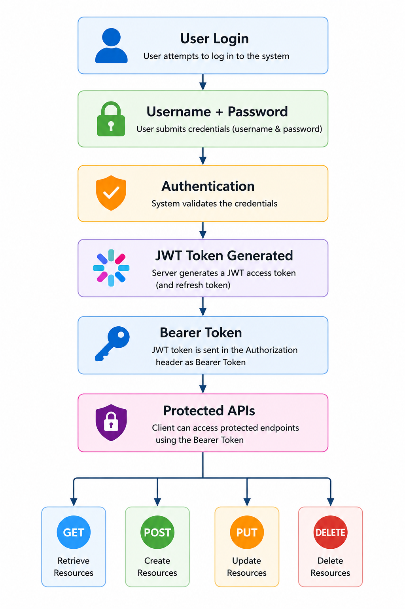
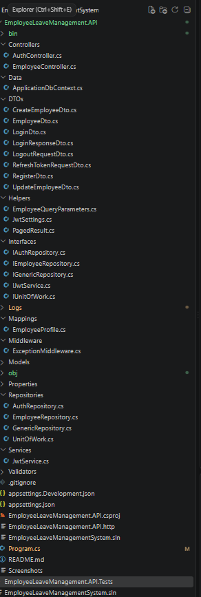
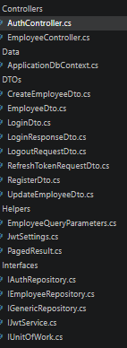
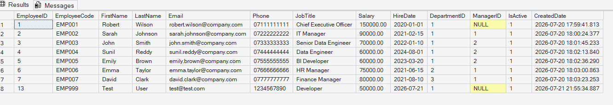
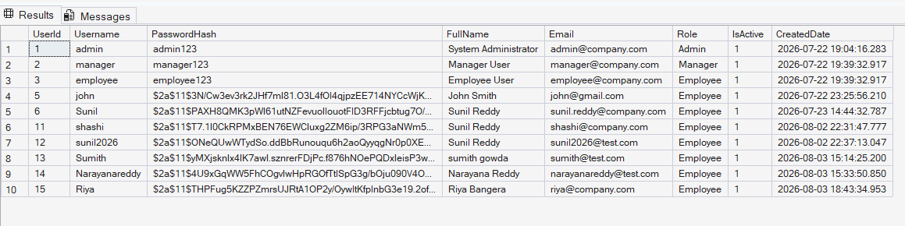
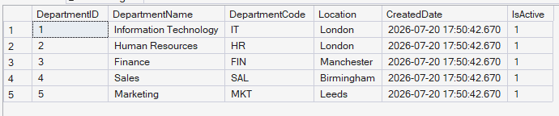
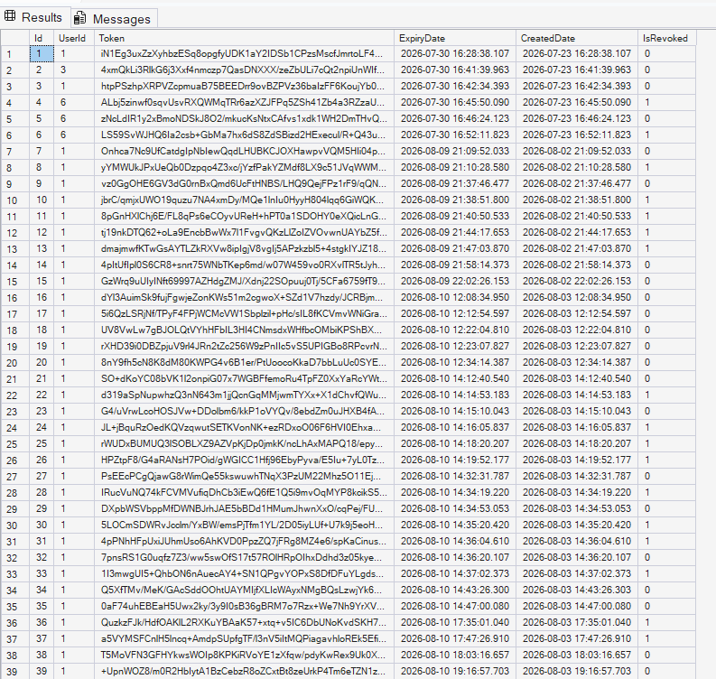

# 🚀 Employee Leave Management System

<p align="center">

A secure and scalable **Employee Leave Management System** built with **ASP.NET Core 8 Web API**, **SQL Server**, **Entity Framework Core**, **JWT Authentication**, **Repository Pattern**, and **Power BI**.

</p>

<p align="center">


</p>

---

# 📖 Project Overview

The **Employee Leave Management System** is a secure RESTful Web API developed using **ASP.NET Core 8** to simplify employee and leave management within an organization.

The application follows modern software engineering principles including the **Repository Pattern**, **Unit of Work**, **Dependency Injection**, and **Entity Framework Core**, providing a clean, scalable, and maintainable architecture.

Authentication is implemented using **JWT Access Tokens** and **Refresh Tokens**, while **Role-Based Authorization** secures protected API endpoints. The solution also integrates **Power BI** dashboards for workforce analytics and reporting.

---

# ✨ Key Features

## 🔐 Authentication & Security

- JWT Authentication
- Refresh Token Rotation
- Secure User Login
- User Registration
- Secure Logout
- BCrypt Password Hashing
- Role-Based Authorization (Admin & Manager)

---

## 👨‍💼 Employee Management

- Create Employee
- View All Employees
- View Employee by ID
- Update Employee
- Delete Employee

---

## ⚙️ Additional Features

- Pagination
- Search
- Sorting
- Filtering
- Global Exception Handling
- FluentValidation
- AutoMapper
- Serilog Logging
- Swagger Documentation

---

# 🛠 Technology Stack

| Category | Technologies |
|-----------|--------------|
| Backend | ASP.NET Core 8 Web API, C# |
| Database | SQL Server, Entity Framework Core |
| Security | JWT Authentication, Refresh Tokens, BCrypt |
| Design Patterns | Repository Pattern, Unit of Work, Dependency Injection |
| Validation | FluentValidation |
| Mapping | AutoMapper |
| Logging | Serilog |
| API Documentation | Swagger (OpenAPI) |
| Reporting | Power BI |
| Development Tools | Visual Studio Code, SQL Server Management Studio, Git, GitHub |

---

# 🏆 Project Highlights

✔ RESTful API Development

✔ Secure JWT Authentication

✔ Refresh Token Implementation

✔ Repository Pattern

✔ Unit of Work Pattern

✔ Entity Framework Core

✔ SQL Server Integration

✔ Swagger API Documentation

✔ Power BI Dashboards

✔ Role-Based Authorization

✔ Structured Logging with Serilog

✔ Global Exception Handling

✔ Clean Architecture

---
# 🏗️ System Architecture

The Employee Leave Management System follows a layered architecture to ensure separation of concerns, maintainability, and scalability. Client requests pass through the API layer, where authentication and authorization are enforced before business logic and data access are executed.

<p align="center">
    
</p>

### Architecture Layers

- **Client** – Swagger UI, Postman, Power Apps or any REST client.
- **ASP.NET Core Web API** – Handles HTTP requests and responses.
- **JWT Authentication** – Secures protected endpoints using Bearer Tokens.
- **Repository Pattern** – Encapsulates all data access logic.
- **Unit of Work** – Coordinates repository operations within a single transaction.
- **Entity Framework Core** – ORM responsible for database interaction.
- **SQL Server** – Stores application data securely.

---

# 🔐 JWT Authentication Flow

The application uses JSON Web Tokens (JWT) with Refresh Tokens to provide secure authentication and authorization.

<p align="center">
    
</p>

### Authentication Process

1. User logs in using username and password.
2. Password is verified using BCrypt hashing.
3. JWT Access Token is generated.
4. Refresh Token is generated and stored in SQL Server.
5. Client sends the Access Token in the Authorization header.
6. Protected APIs validate the token before processing requests.
7. When the Access Token expires, the Refresh Token generates a new Access Token without requiring the user to log in again.

---

# 📂 Project Structure

```text
EmployeeLeaveManagementSystem
│
├── Controllers
├── Data
├── DTOs
├── Helpers
├── Interfaces
├── Mappings
├── Middleware
├── Models
├── Repositories
├── Services
├── Validators
│
├── Database
├── PowerBI
├── Screenshots
│
├── Program.cs
├── appsettings.json
├── EmployeeLeaveManagement.API.csproj
└── README.md
```

### Project Structure

<p align="center">
    
</p>

### Solution Explorer

<p align="center">
    
</p>

---

# 🗄️ Database Design

The application uses Microsoft SQL Server with Entity Framework Core.

### Database Tables

| Table | Description |
|--------|-------------|
| Users | Stores registered users and roles |
| Employees | Stores employee information |
| Departments | Stores department details |
| RefreshTokens | Stores JWT Refresh Tokens |

---

### Employee Table

<p align="center">
    
</p>

---

### Users Table

<p align="center">
    
</p>

---

### Departments Table

<p align="center">
    
</p>

---

### Refresh Tokens Table

<p align="center">
    
</p>

---

# 📡 REST API Endpoints

## Authentication APIs

| Method | Endpoint | Description |
|---------|----------|-------------|
| POST | `/api/Auth/register` | Register a new user |
| POST | `/api/Auth/login` | Authenticate user and generate JWT |
| POST | `/api/Auth/refresh-token` | Generate a new Access Token |
| POST | `/api/Auth/logout` | Revoke Refresh Token |

---

## Employee APIs

| Method | Endpoint | Description |
|---------|----------|-------------|
| GET | `/api/Employee` | Retrieve all employees |
| GET | `/api/Employee/{id}` | Retrieve employee by ID |
| POST | `/api/Employee` | Create employee |
| PUT | `/api/Employee/{id}` | Update employee |
| DELETE | `/api/Employee/{id}` | Delete employee |

---
